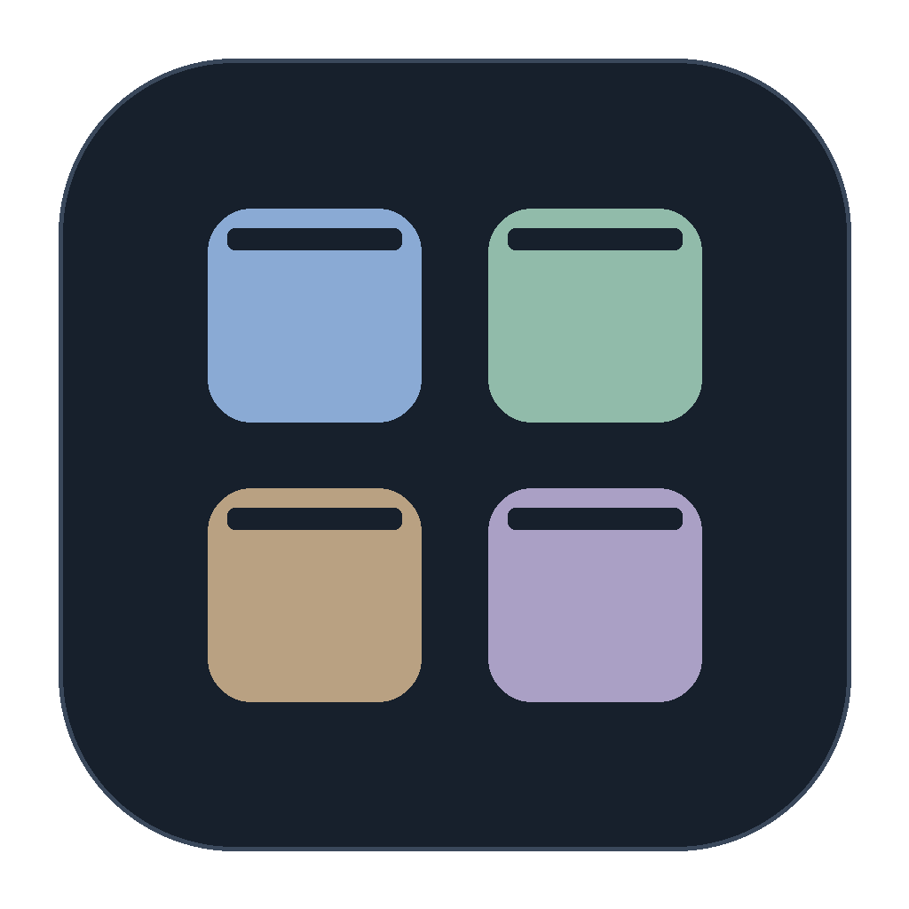
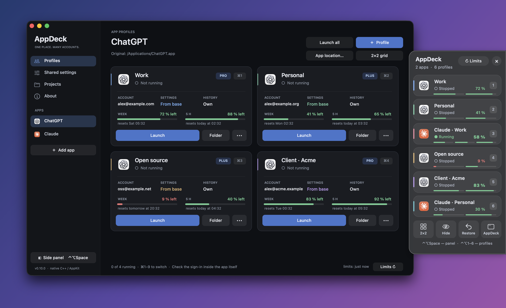
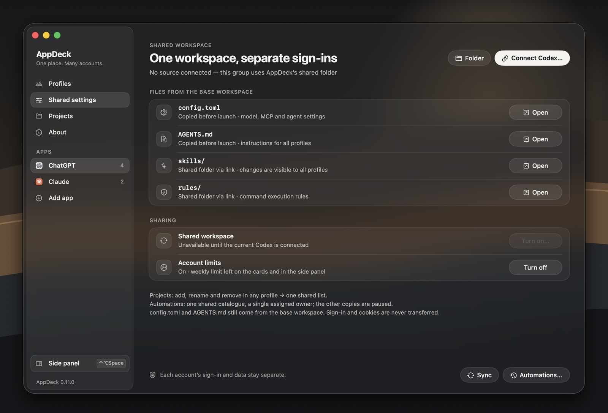
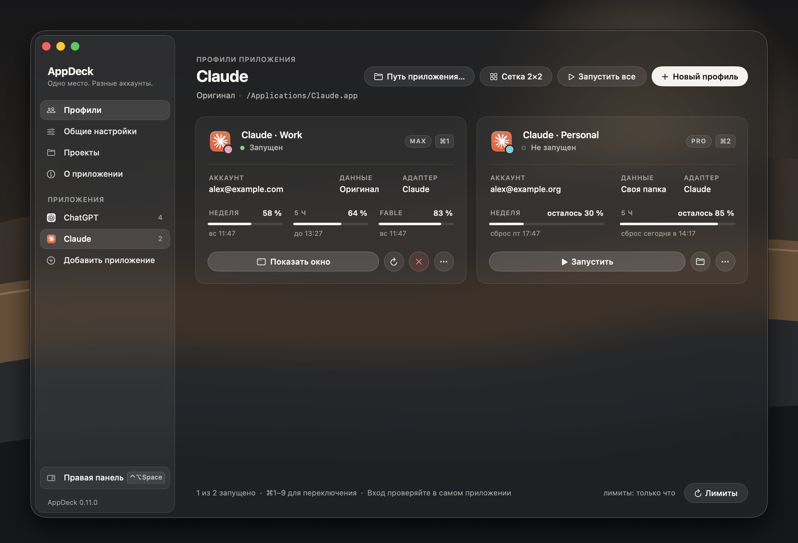

<div align="center">



# AppDeck

**Several accounts of the same Mac app, side by side — one window per account, one shared workspace.**

[](https://github.com/veniameen/AppDeck/actions/workflows/ci.yml)
[](CHANGELOG.md)


[](LICENSE)



</div>

AppDeck is a small native macOS app for people who work in the same desktop app under several accounts — typically [Codex](https://openai.com/codex/) (`ChatGPT.app`) or [Claude Desktop](https://claude.ai/download) with a personal and a work subscription. Every profile is an ordinary window of the original app with its own sign-in. AppDeck launches them, keeps their data apart, shows how much of each account's usage limit is left and lets you switch between them from anywhere.

**New in 0.12:** a proxy per profile or for all of them — HTTP or SOCKS5 with a login, through a private local bridge — and a simpler Add app dialog. See the [changelog](CHANGELOG.md).

## Features

- **One card per account.** The app's icon with the profile's colour badge, the signed-in account and its plan, a status light, and the usage limits with their reset times. **Launch** starts the profile; a running one offers **Show window**, **Restart** and **Close** (a normal quit request, never a force kill).
- **Separate sign-ins, shared work.** Each profile gets its own private data folder, so every window stays signed in to its own account. For Codex you can share settings, chat history, projects and automations between the accounts — without copying a single database or token.
- **Usage limits at a glance.** The weekly, 5-hour and per-model windows of every Codex and Claude account, asked from the apps' own tools. Meters stay neutral while there is room, turn amber below 25 % and red below 10 %; the account with the most headroom stands out in the side panel.
- **Side panel.** Press <kbd>⌃</kbd><kbd>⌥</kbd><kbd>Space</kbd> in any app and switch accounts without opening the main window.
- **Proxy per profile.** Start any profile through an HTTP or SOCKS5 proxy with a login and password — for example past the VPN of your router. Set a default for all profiles or choose one per profile; a private local bridge adds the credentials, fails over along your address list and keeps QUIC and WebRTC inside the proxy.
- **Window tools.** Arrange four windows in a 2×2 grid and put them back, hide every profile at once, reopen a window that was closed with the red button.
- **Graphite glass.** A dark translucent interface in the manner of macOS 26: a floating sidebar, one bone-white ink, capsule controls of one height, colour only for state and for each profile's badge.
- **Native and light.** A C++17 app on public AppKit and Objective-C runtime APIs, plus a tiny libSystem-only proxy bridge. No Electron, no WebView, no network client of its own, no telemetry. A universal binary for macOS 13 and later.
- **English and Russian.** The interface follows your macOS language.

## The side panel


<kbd>⌃</kbd><kbd>⌥</kbd><kbd>Space</kbd> opens a slim glass panel at the right edge of the screen, over whatever you are doing. It lists the profiles of every app in your own order:

- a click — or <kbd>⌃</kbd><kbd>⌥</kbd><kbd>1</kbd>…<kbd>8</kbd> from anywhere — launches a profile or brings its window forward;
- each row shows the profile's colour, a status light (running, active, hidden, stopped), the limit closest to its wall and one thin meter per limit window;
- drag a row to reorder; the same order drives the shortcuts, the menu bar menu and the main window;
- at most six rows are visible, the rest scroll, and the list stays clean at rest — a soft edge appears only while a row is cut;
- the toolbar arranges windows **2×2**, **Hides** them, **Restores** their places or opens AppDeck.

The panel never becomes the key window and never records the screen: rows show profile states, not pictures of windows.

<br clear="right">

## A closer look

<p align="center">


</p>

**Shared settings** of a Codex group (left): which files every profile takes from the base workspace, shared history and the limits switch. **The Russian interface** (right): Claude profiles with their 5-hour, weekly and per-model limits.

## Supported apps

| App | What a profile gets | Extras |
|---|---|---|
| Codex (`ChatGPT.app`) | Its own `CODEX_HOME`, Electron user data and sign-in | Shared settings, history, projects and automations (opt-in); usage limits |
| Claude Desktop | Its own `CLAUDE_USER_DATA_DIR` and sign-in | Usage limits through a Claude Code sign-in |
| VS Code, Cursor | Its own user data and extensions folder | — |
| Chrome, Brave, Edge, Chromium | Its own browser profile folder | — |
| Other Electron apps | Its own user data folder (experimental) | — |

The original app is never copied or modified: AppDeck starts it with its own documented switches.

## Install

**Build from source** — needs macOS 13+ and the Apple Command Line Tools (`xcode-select --install`), nothing else:

```sh
git clone https://github.com/veniameen/AppDeck.git
cd AppDeck
make install          # builds build/AppDeck.app and copies it to /Applications
```

If AppDeck is already running, quit it first (**AppDeck → Quit AppDeck**); your profile windows keep running and AppDeck reconnects to them.

**Or download** `AppDeck.zip` from [Releases](https://github.com/veniameen/AppDeck/releases), unzip it and move `AppDeck.app` to Applications with Finder before the first launch.

AppDeck is signed ad hoc, not with a Developer ID, and is not notarized. On first launch macOS may refuse to open it: open **System Settings → Privacy & Security** and click **Open Anyway** for AppDeck. Please do not disable Gatekeeper.

## Quick start

1. Click **Add app** in the sidebar and choose `ChatGPT.app`, `Claude.app` or another supported app.
2. Create a profile per account with **New profile**. For Codex, **Shared settings → Connect Codex…** keeps your current Codex as the primary profile and lets the others share its workspace.
3. **Launch** a profile and sign in inside its window. Sign in to one new account at a time.
4. Turn on **Account limits…** (at the bottom of the Profiles page) to see what every account has left, and press <kbd>⌃</kbd><kbd>⌥</kbd><kbd>Space</kbd> to switch from anywhere.

The [user guide](docs/USER_GUIDE.md) explains every option; it is also available inside the app under **About → User guide**.

## Keyboard shortcuts

| Shortcut | Action |
|---|---|
| <kbd>⌃</kbd><kbd>⌥</kbd><kbd>Space</kbd> | Show or hide the side panel |
| <kbd>⌃</kbd><kbd>⌥</kbd><kbd>1</kbd> … <kbd>8</kbd> | Launch the profile in that place, or bring its window forward |
| <kbd>⌘</kbd><kbd>1</kbd> … <kbd>9</kbd> | The same for the selected app, while the AppDeck window is active |

The shortcuts are registered hot keys: no Input Monitoring permission is needed. **2×2** and **Restore** need the Accessibility permission; everything else works without it.

## Privacy and safety

- AppDeck never copies, links or edits the managed apps' databases and never reads or shares `auth.json`, cookies or Keychain items. Sign-ins stay in each profile's private folder.
- It has no network client of its own. Codex limits come from the app's own `codex app-server` (`account/read`, `account/rateLimits/read`); Claude limits from Claude Code's `get_usage` request in `--safe-mode`, which sends no message to the model. AppDeck never sees a token.
- A proxy is opt-in: its passwords stay in a private file (mode 0600) and reach the local bridge through a pipe; the bridge listens on `127.0.0.1` only and exits with the window it serves.
- Limits are asked rarely: each account at most once an hour, with at least five minutes between two accounts; **Limits** asks now.
- Everything it keeps is in `~/Library/Application Support/AppDeck`. Diagnostics contain no tokens, configuration contents or account addresses.
- Profiles are separated by data, not sandboxed: every app still runs as your macOS user. See [SECURITY.md](SECURITY.md).

## Limitations

- Not notarized; local builds are signed ad hoc, so macOS may ask for Accessibility again after an update.
- Codex's `app-server` protocol and desktop project cache are internal and may change with a new `ChatGPT.app`; AppDeck then shows “no data” or skips the sync instead of guessing.
- Some scenarios are not verified yet — for example several different real accounts sharing history at the same time, multi-monitor setups and Intel hardware. The current status is in [docs/TESTING.md](docs/TESTING.md).

## Development

```sh
make            # build/AppDeck.app (universal, warnings as errors, ad-hoc signed)
make test       # localization check + portable policy tests with ASan/UBSan
make verify     # full acceptance on this Mac: native sync fixtures, API and Accessibility smoke tests
APPDECK_GUI_SELFTEST=1 make verify   # plus the side panel self-test, arm64 and x86_64, English and Russian
```

Screenshots and design reviews use fictional data and never touch real profiles:

```sh
python3 tools/make_demo_data.py /tmp/appdeck-demo
APPDECK_DATA_ROOT=/tmp/appdeck-demo build/AppDeck.app/Contents/MacOS/AppDeck -AppleLanguages '(en)'
APPDECK_DATA_ROOT=/tmp/appdeck-demo APPDECK_RENDER_DIR=/tmp/appdeck-pages build/AppDeck.app/Contents/MacOS/AppDeck
```

The second command runs a separate demo instance (use `'(ru)'` for Russian); the third draws every page and the side panel into PNG files and exits.

```
src/        C++17 sources: main.cpp and its headers; pure policy headers are unit-tested
tests/      portable tests, macOS smoke and integration tests
tools/      help page, localization check, bundle verifier, sandbox and demo data
scripts/    build, test, verify and install
assets/     Info.plist, icon, localized Info.plist strings
docs/       user guide, architecture, sync design, testing, screenshots
```

Read [CONTRIBUTING.md](CONTRIBUTING.md) and the hard rules in [AGENTS.md](AGENTS.md) before sending changes. Design notes: [architecture](docs/ARCHITECTURE.md), [project and automation sync](docs/SYNC_DESIGN.md), [references](docs/REFERENCES.md). Release notes: [CHANGELOG.md](CHANGELOG.md).

## License

[MIT](LICENSE). AppDeck is an independent project, not affiliated with OpenAI or Anthropic; ChatGPT, Codex and Claude are trademarks of their owners.
