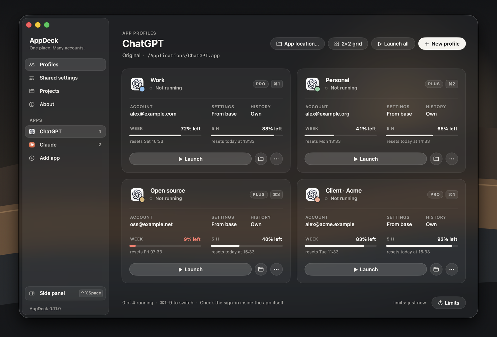
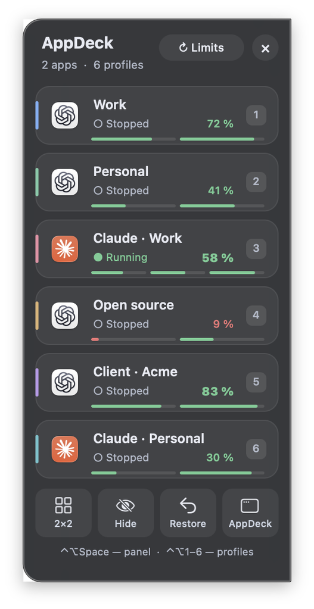

# AppDeck User Guide

AppDeck runs several accounts of the same desktop app side by side on macOS — for example two or three Codex windows (`ChatGPT.app`), each signed in to a different account, sharing one workspace. This guide covers everyday use; the design is described in [ARCHITECTURE.md](ARCHITECTURE.md) and [SYNC_DESIGN.md](SYNC_DESIGN.md).

## Contents

- [Getting started](#getting-started)
- [What is separate and what is shared](#what-is-separate-and-what-is-shared)
- [Codex: use your current Codex as the base](#codex-use-your-current-codex-as-the-base)
- [Shared history and projects](#shared-history-and-projects)
- [Shared automations](#shared-automations)
- [Account limits (Codex)](#account-limits-codex)
- [Claude Desktop](#claude-desktop)
- [Claude limits](#claude-limits)
- [The side panel](#the-side-panel)
- [Window layout and permissions](#window-layout-and-permissions)
- [Signing in to several accounts](#signing-in-to-several-accounts)
- [Initial project list (experimental)](#initial-project-list-experimental)
- [Language](#language)
- [Data, updates and diagnostics](#data-updates-and-diagnostics)

## Getting started

1. **Add an app.** Click **Add app** in the sidebar and choose an installed app. AppDeck detects the adapter: Codex (`ChatGPT.app`), Claude Desktop, VS Code / Cursor, Chrome / Brave / Edge / Chromium, or an experimental mode for other Electron apps. The original `.app` is never copied or modified.
2. **Create profiles.** Each profile is an ordinary macOS window of that app with its own private data folder and therefore its own sign-in. Use **New profile** for more.
3. **Launch and sign in.** Click **Launch** on a card and sign in inside the app window. Sign in to one new account at a time.
4. **Switch.** Click **Show window** on a card, press **⌘1–9** while AppDeck is active, or open the [side panel](#the-side-panel) with **⌃⌥Space** from anywhere.

A running profile's card offers **Show window** (bring it forward) and two round buttons: **Restart** ↻ (quit, then launch again once the process has really exited) and **Close** ✕ (a normal quit request — never a force kill). A stopped card has **Launch**, the profile folder and, after a failed start, a warning button that explains what happened. Every round button names itself in its tooltip. If a window was closed with the red button, AppDeck reopens it: it sends the same *reopen* event the Dock icon sends, addressed to that very process.

## What is separate and what is shared

AppDeck separates **data**, not security domains: every profile runs as your macOS user and can reach the same files. It is not a sandbox or a virtual machine. For editing the same repository from several accounts at once, use separate Git worktrees.

| Adapter | How a profile is isolated | Shared on purpose |
|---|---|---|
| Codex (`ChatGPT.app`) | Own `CODEX_HOME`, `CODEX_ELECTRON_USER_DATA_PATH` and `--user-data-dir` in the profile folder | Optional: settings, history, projects and automations — see below |
| Claude Desktop | Own `CLAUDE_USER_DATA_DIR` and `--user-data-dir` | The Code tab's `~/.claude` (AppDeck never sets `CLAUDE_CONFIG_DIR`) |
| VS Code / Cursor | Own `--user-data-dir` and `--extensions-dir` | Nothing |
| Chromium browsers | Own `--user-data-dir` | Nothing |
| Other Electron apps | Own `--user-data-dir` (experimental) | Nothing |

Sign-ins, cookies and window data are **never** copied or shared between profiles.

## Codex: use your current Codex as the base

In a Codex group open **Shared settings → Connect Codex…** and choose your current Codex data folder, usually `~/.codex` (press ⌘⇧G to type a path). When you add a Codex group for the first time, AppDeck offers this dialog by itself.

The dialog can also add **Primary · current**: a card for the Codex you already use. AppDeck attaches to that running window, or opens the original app normally, without touching its configuration or sign-in — your existing projects, history and look stay in the **original** Codex. The primary card becomes the first card of its app; you can reorder it later.

Copies are recognized by their own `--user-data-dir` argument, so the order of launches does not matter. If several Codex processes run **without** such an argument (for example one you opened with `open -n`), AppDeck does not guess which one is primary: close the extra one and retry.

For linked copies:

| Data | Behaviour |
|---|---|
| `config.toml` | Read from the base and copied before a stopped copy launches. The sign-in store is forced to `file`, so it stays inside the copy's own `CODEX_HOME`. |
| `AGENTS.md` | Copied before launch. Project `AGENTS.md` files stay in their repositories. |
| `skills/`, `rules/` | Linked to the base folders when they exist; changes are visible to every profile. |
| `~/.agents/skills` | Stays the same folder of your macOS user; AppDeck does not move it. |
| Repositories | Never copied: every profile uses the same paths on disk. |
| History, projects, automations | Shared only if you turn on the shared workspace (next section). |
| Sign-in, cookies, window data | Never copied or shared. Sign in to each copy separately. |

This is not a full mirror of the Codex interface: appearance and internal UI settings are not synchronized.

Configuration can hold MCP tokens, provider settings and organization restrictions; they are inherited through the explicitly connected `config.toml`. `forced_chatgpt_workspace_id` restrictions are never removed. AppDeck's TOML editing is deliberately conservative: an ambiguous sign-in key or a multi-line string stops the automatic preparation instead of rewriting arbitrary TOML.

## Shared history and projects

Codex keeps the chat list, projects, sections and pins in `state_5.sqlite` and the content in `thread_history_1.sqlite` and `sessions/`. A copy with its own `CODEX_HOME` starts empty. Turn on **Shared settings → Shared workspace** (or answer the question on the first launch of a linked copy) and AppDeck:

- passes `CODEX_SQLITE_HOME=<base folder>` to copies — Codex's own switch for its database folder;
- links `sessions`, `archived_sessions` and `thread-writer-locks` in the copy's `CODEX_HOME` to the base folders, only if the copy has no non-empty folders of its own.

Databases and files are **never copied, linked or edited** by AppDeck; `auth.json`, cookies and `user-data` stay per account. Several Codex processes on one database is a normal situation for Codex (the CLI, IDE extensions and the desktop app share `~/.codex` the same way).

**Projects.** Codex also keeps each window's sidebar in its `.codex-global-state.json`, so a shared database alone is not enough. AppDeck keeps a group journal — the last known list of every participant, revisions and deletion tombstones — and reconciles projects in both directions:

- Additions, renames and removals are read from every linked profile, the primary one included. The first observation merges the existing lists; after that, removing a known project removes it everywhere. Removal keeps the folder and its tasks.
- Files are written only while that instance is fully stopped, through Codex's own app-server API plus allow-listed fields of its sidebar cache. The previous file is kept next to it as `.appdeck-previous`. Unknown or damaged data is never replaced by an empty list.
- Concurrent edits are resolved by revision in a stable participant order; a removal wins over an edit of the same generation, and conflicts are recorded. A stale copy cannot bring a removed project back.
- While AppDeck runs, changes are collected into the journal periodically; **Sync ↻** checks now. A running window shows **Running · updates pending** and picks the changes up after **Restart** — focusing a window never rewrites its files.

What to keep in mind:

- History becomes truly shared: a chat created in any copy appears in the primary Codex and the other way round. The other Codex databases in that folder (log, queue, memory, goals) become shared as well.
- Continuing a chat that was started under another account depends on Codex's own rules; reading history does not.
- Do not write to the same chat from two windows at once.
- A copy's previous own history is hidden (not deleted) while sharing is on and comes back when you turn it off. Turning it off removes only AppDeck's own links.
- The **HISTORY** column of a card shows **Shared** or **Own**.

## Shared automations

With the shared workspace on, AppDeck also transfers supported `automations/<id>/automation.toml` definitions. The prompt, schedule and other recognized fields can be edited in any linked profile; removing a known automation removes it everywhere (repositories and tasks are never deleted).

Each automation has **one owner**: the profile where it was created. In the other profiles its copies are **PAUSED**, and enabling such a copy does not make it an owner — AppDeck pauses it again when it reconciles that stopped profile. To change the owner, close the group's instances and use **Shared settings → Automations…**: the other copies are paused first, then the new owner is applied. A schedule that was paused stays paused.

Run the owner profile and enable the schedule there: AppDeck is not a scheduler and never fails over to another profile. Conflicting edits of one definition stay conflicts. Transferring a definition does not transfer run history, queues or memory.

## Account limits (Codex)

Turn it on once per Codex group: with **Account limits…** at the bottom of the Profiles page or in **Shared settings**; the same place turns it off and forgets the cached numbers.

**Where the numbers come from.** AppDeck makes no network requests and never opens `auth.json`. It starts the chosen app's own helper, `Contents/Resources/codex app-server`, with the profile's data folder and asks two questions of the official protocol: `account/read` (which account is signed in) and `account/rateLimits/read` (the limit windows), with token refresh switched off. Codex itself talks to OpenAI, the same way its window does. The helper lives for a second or two, like any second Codex client next to the window.

**What is stored:** percentages, reset times, the plan, an exhaustion flag and the account address for the card label. No tokens. Diagnostics never include addresses.

**How often.** Strictly one profile at a time. Automatically at most once an hour per account and at least five minutes between two automatic checks of any profiles — no event-driven extra checks. Manually with **Limits ↻** or a click on a card's limit strip: immediately, at most once every 20 seconds per account.

**Reading it.** “WEEK — 37% left”, a thin meter and “resets Sat 11:10”. The number and the meter stay in the neutral ink from 25 %, turn amber at 10–24 % and red below 10 %; “used up” at 0 %. With three windows (Claude) a card shows only the numbers, to keep the three columns readable. Windows are identified by duration, not by name. Grey numbers with “data from …” are the last good answer when a fresh one failed; a window whose reset time has passed shows “window reset” until it is checked again. **Not signed in** means the profile has never been launched or was signed out.

**One account in two profiles.** If two profiles of a group are signed in to the same account, the address is marked with ⚠: their limit is one and the same. Sign out in that window and sign in with the right account (in the browser, use a private window or sign out of ChatGPT first).

Consent dialogs (limits, shared history) cannot be accepted with Return; Escape declines. The `app-server` protocol is marked experimental by Codex: after an update of `ChatGPT.app` a card may show “no data” instead of numbers — nothing else breaks.

## Claude Desktop

Add `Claude.app` with **Add app**; the Claude Desktop adapter is preselected. The checkbox **Add the existing sign-in (current window) as the primary profile** creates **Primary · current**: the ordinary Claude with its usual data, attached or launched normally. Every other profile is a new, empty sign-in.

| Data | Behaviour |
|---|---|
| Sign-in, cookies, window settings, `claude_desktop_config.json` (MCP) | Per profile: `Profiles/<id>/user-data`, passed through Claude's own `CLAUDE_USER_DATA_DIR` and `--user-data-dir`. |
| Code tab: settings, history, skills, memory (`~/.claude`) | Shared by all profiles — AppDeck never sets `CLAUDE_CONFIG_DIR`. |
| The original `~/Library/Application Support/Claude` | Not opened by copies. |
| Limits | Available through a Claude Code sign-in — see below. |
| Shared history, project and automation sync | Codex only. |

## Claude limits

**Why a separate sign-in is needed.** Anthropic counts limits per account, and Claude Code can report them through its standard `get_usage` control request. But Claude Desktop hands its sign-in to the embedded Claude Code in memory — there is nothing on disk to ask “on behalf of the window”. So for each Claude profile AppDeck keeps a **Claude Code configuration folder** in its own data (`ClaudeMeter/<id>`, not `~/.claude`) that you sign in to once, with the same account as the profile's window.

**Turning it on.** Use **Account limits…** at the bottom of a Claude group's Profiles page (or **Shared settings**) and confirm. The card then shows “Claude Code sign-in needed to show limits — click here” → **Sign in…**: AppDeck opens Terminal with the standard `claude auth login --claudeai` for that folder. In the browser choose **the same account** as in the profile's window. Afterwards click the limits line → **Check again**.

**What AppDeck runs.** First `claude auth status`, then once `claude -p --safe-mode --input-format stream-json --output-format stream-json --no-session-persistence` with the `get_usage` control request. `--safe-mode` turns off your hooks, plugins, MCP servers and `CLAUDE.md`; no message is sent to the model and nothing is consumed. The environment is scrubbed of `ANTHROPIC_*`, `CLAUDE_CODE_*` and any foreign `CLAUDE_CONFIG_DIR`; the working folder is an empty folder inside AppDeck's data. `CLAUDE_CODE_DISABLE_NONESSENTIAL_TRAFFIC` must not be used: with it, Claude Code does not request the limits either. Claude Code keeps the tokens (Keychain); AppDeck never sees them. The schedule is the same as for Codex.

**What is shown.** Windows come from the server's `limits[]` list: all-models week, 5 hours and a per-model week with the server's label (for example **FABLE**). Percentages are what is **left** — Claude itself shows what is used (36 % used = 64 % left). The address on the card is the Claude Code sign-in; it must match the account of the window, otherwise the numbers belong to another account.

**Which `claude` is used:** `~/.local/bin/claude`, otherwise the newest copy that Claude Desktop downloaded for its Code tab, otherwise `/opt/homebrew/bin` or `/usr/local/bin`.

## The side panel

Click **Side panel** at the bottom of the sidebar or press **⌃⌥Space** in any app. The main window and AppDeck's Dock icon step aside, and a slim glass panel unfolds at the right edge of the screen under the pointer: one column with the profiles of every app. It shows each profile's icon with its colour badge, name, status light, limit and place number — not a picture of its window, so no screen recording permission is needed.

At most **six rows** are visible (fewer on a short screen); further profiles scroll. The panel always opens at the top and without any shading; a soft edge appears only while a row is cut by the top or bottom edge during scrolling.

**The order is yours.** Drag a row up or down — the other rows make room, the list scrolls by itself near its edges, and the order is saved on release — or use **Move up / Move down / Move to top** in the row's right-click menu. The same order drives the ⌃⌥ shortcuts, the AppDeck menu in the menu bar and, per app, the cards of the main window, where **•••** → **Move up / down** reorders a card among its app's cards.

| Action | Result |
|---|---|
| Click a row | Launch the profile or bring its window forward (reopening a window closed with the red button). |
| Drag a row | Change the order. A movement under 4 points is still a click. |
| Scroll over the list | Show the profiles below the first six. |
| Right-click a row | Open / launch, restart, close the instance, refresh its limit, move up / down / to top. |
| **Limits** | Check the limits of every profile now (shown when limits are on). |
| ⌃⌥1 … ⌃⌥8 | Switch to the profile in that place of the list, even when it is scrolled out of view. |
| **2×2** | Arrange the first four running profiles in panel order on this screen, then hide the panel. |
| **Hide** | Hide the windows of all profiles (no quit, no kill). |
| **Restore** | Put the windows back where they were before the last 2×2 (while AppDeck keeps running). |
| **AppDeck** | Bring back the main window and the Dock icon. |
| **×** / ⌃⌥Space | Hide the panel. The menu bar item stays. |

Global shortcuts are registered hot keys, not an input tap, so no Input Monitoring permission is needed. Another utility may already own a combination; the menu bar item always works.

## Window layout and permissions

**2×2** and **Restore** need the **Accessibility** permission (System Settings → Privacy & Security → Accessibility → AppDeck). Without it, launching and switching still work. With it, AppDeck also un-minimizes a window and raises it. A click brings a window forward; it does not pin another app on top of everything — AppDeck uses no private WindowServer API, no focus stealing loop and never modifies the apps it manages.

Layout respects the usable screen area, the Dock, the menu bar and monitors with negative coordinates, and checks the real size afterwards. An app's minimum window size or full screen can prevent four windows from fitting; AppDeck says so instead of claiming success.

## Signing in to several accounts

Connect the primary Codex first, then launch additional accounts one at a time and check the account address in each window. If a new copy unexpectedly shows an account that is already in use elsewhere, **do not click Sign out**: close it and check the adapter's compatibility. If the app returns an already running process instead of a new instance, AppDeck treats that as a failed isolation and says so.

## Initial project list (experimental)

For groups **without** shared history only (with it, the group reconciliation above applies). From `.codex-global-state.json` AppDeck recognizes the `local-projects` registry, `project-order` and the older `electron-saved-workspace-roots` / `electron-workspace-root-labels`; only absolute local paths and short labels are kept. History, task assignments, cloud projects and remote hosts are excluded. This is Codex's internal format, not a stable API: a new Codex may ignore it, in which case the folders are still listed in AppDeck. It is written only into a **new** profile that has no `.codex-global-state.json` yet.

## Language

AppDeck is in English, or in Russian when Russian comes before English in your preferred languages (System Settings → General → Language & Region). You can also choose a language for AppDeck alone under **Applications** in the same settings. The user guide inside the app follows the same choice.

## Data, updates and diagnostics

Everything AppDeck keeps is in `~/Library/Application Support/AppDeck`:

| Path | Contents |
|---|---|
| `state.plist` | Apps, profiles (in your order), projects and cached display data. |
| `Profiles/<id>/` | One private folder (mode 0700) per profile: `user-data`, and `codex` for Codex profiles. |
| `Shared/<app id>/` | Fallback shared settings and the group sync journal of a Codex group. |
| `ClaudeMeter/<id>/` | Claude Code folders used only to read Claude limits. |
| `Cache/usage-probe/` | The empty working folder the limit probes run in. |

**Updating.** Quit AppDeck from its menu (your profile windows keep running; AppDeck reconnects to them), replace `AppDeck.app` and open it again. Move the app with Finder before the first launch: an app that was downloaded and never moved runs from a temporary copy (App Translocation) where the Accessibility permission does not stick — AppDeck warns about it. Local builds are signed ad hoc, so macOS may ask for Accessibility again after an update.

**Diagnostics.** **About → Diagnostics…** saves a report with the macOS version, architecture, adapters, feature states and recent events — without tokens, configuration contents or account addresses.

**Removing a profile** removes only AppDeck's entry; its folder stays in `Profiles/` until you delete it in Finder. Never edit `state.plist` while AppDeck is running.
